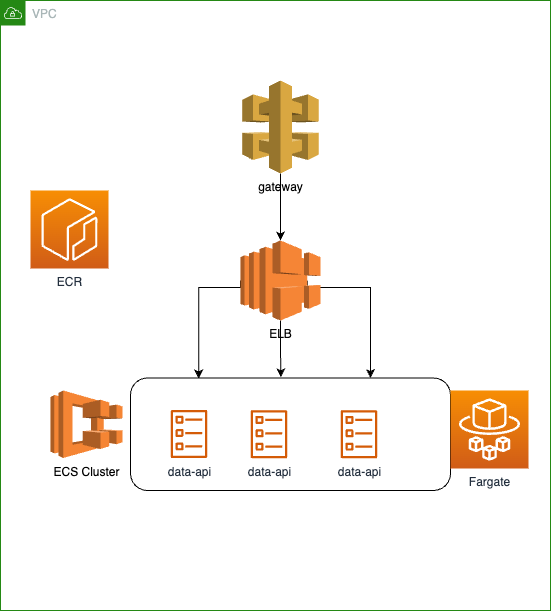

# API

## Build

```bash
docker build -t data_api .
```

## Run
```bash
docker run -d -p 9000:8000 --name data_api_container data_api
```

## Local Test

```bash
curl -X GET "http://localhost:9000/predict?height=170&weight=90&shoe=40"
```
Result: `{"prediction":"male"}`

```bash
curl -X GET "http://localhost:9000/predict?height=170&weight=90&shoe=39"
```
Result: `{"prediction":"female"}`

# Deployment into AWS

Diagram:  



## Deployment
IaC using Terraform can be found [here](./terraform)
